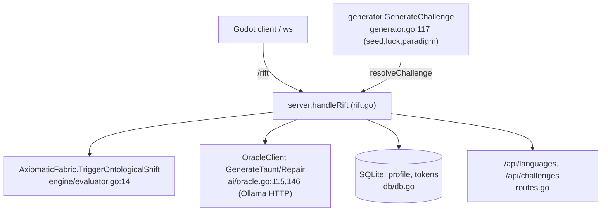
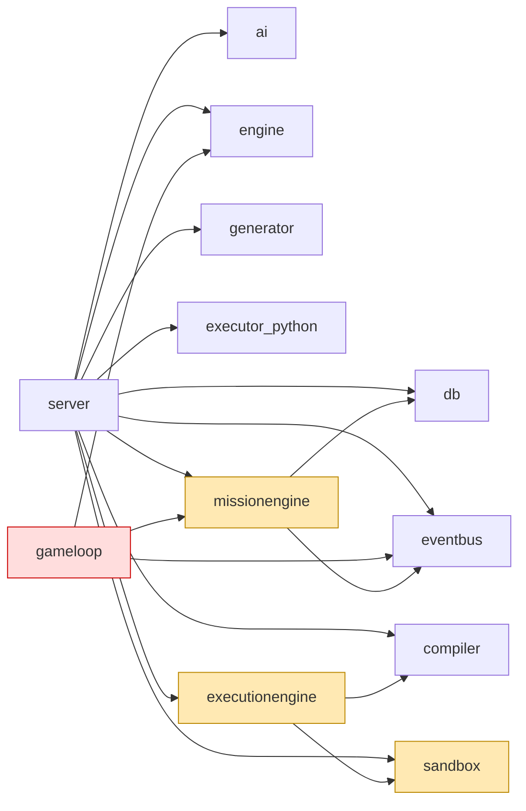

# Engineering Audit — Challenge To YOU

*Read-only, fact-based audit. Every claim is backed by a file/line reference.
"Reality" = code; "intended" = CONTEXT.md, README.md, docs/CHALLENGE-TO-YOU-PLAN.md,
docs/DECISIONS/*, docs/problems/specifications.md, architecture docs.
No code was changed. Audit date: 2026-07-13.*

Backend size: **7,854** non-test LOC, **4,479** test LOC (Go). Plus a separate
`phoenix/` module (self-healing CI tooling) and a Go `qa/` end-to-end module.

---

## 1. Executive Summary

The **live game** is a thin, deterministic **flaw-trigger state machine** exposed over
one WebSocket route (`/rift`). Its entire runtime gameplay loop is:
`AxiomaticFabric.TriggerOntologicalShift(event)` → Oracle taunt/repair → SQLite
progression (`internal/server/rift.go:187`, `:198–214`, `:378`, `:401`).

Around that live core sits a **large amount of built-and-tested but runtime-unwired
code**. Several substantial subsystems are instantiated but never invoked, or imported
by nothing outside their own tests:

- **Dead at runtime (no non-test importer):** `internal/gameloop` (~1,312 LOC incl.
  replay/telemetry/resources), `internal/jobqueue` (202), `internal/ratelimit` (135),
  `internal/content` (693), composite-challenge combiner in `internal/engine/composite.go`.
- **Instantiated in `server.go` but never called by the live handler:**
  `execEngine` (executionengine), `missionManager` (missionengine), `s.sb`
  (subprocess sandbox) — see `internal/server/server.go:63–85` vs. the absence of any
  call site in `rift.go`.

**P-Script, a custom VM/interpreter/compiler, a constraint solver, and swarm systems
do not exist** (0 code references). "Compiler" is a language-registry façade; the only
VM is the external `goja` JS engine.

Gameplay **modes (architect/ghost/saboteur) have no behavioral implementation** — they
are a metadata string on a pack entry (`internal/engine/pack.go:28`) with zero branching
logic anywhere.

Bottom line: the deterministic single-challenge engine, procedural generator, save
system, and QA harness are solid and real. The mission layer, game loop, code-execution
sandbox path, and the entire M5–M7 roadmap (constraint solver, P-Script, swarm, emergent
gameplay) are either unwired or absent.

---

## 2. Architecture — live runtime path

Live entry points (only three): `/rift`, `/api/languages`, `/api/challenges`
(`internal/server/server.go:96–100`).

## 3. Dependency graph (import reality)

- **Red = dead** (imported by no non-test code): `gameloop`, `jobqueue`, `ratelimit`,
  `content`. Evidence: `grep -rl 'internal/<pkg>"' --include=*.go` returns only the
  package's own files/tests.
- **Amber = instantiated but not invoked by the live handler**: `executionengine`,
  `missionengine`, `sandbox` (subprocess). Evidence: only appear at
  `server.go:63–85` (construction), never in `rift.go`.

## 4. Ownership

| Resource | Owner | Lifecycle | Evidence |
|----------|-------|-----------|----------|
| DB (`*db.DB`) | `Server` | `initDeps()` → passed to missionManager | `server.go:71,85` |
| EventBus | `Server` | created; **no publishers fire in the live path** (publishers live in dead `gameloop` and in `missionengine`, which is never invoked by the handler) | `server.go:51`; `gameloop/loop.go:278`; `missionengine/manager.go:177,381` |
| AxiomaticFabric | per-request `session` | built once per challenge, mutated per event | `server.go:94`; `rift.go:187` |
| PlayerProfile | DB, single row `id=1` | versioned + checksummed | `db/db.go:315,352` |
| Sessions | `session` struct in `rift.go` | per-connection; **no SessionManager** | `rift.go` |

There is **no graceful shutdown** and **no SessionManager** (both are PLAN Milestone-3
deliverables); sessions live only inside the WebSocket handler goroutine.

---

## 5. Gameplay Capability Matrix (Phase 2 + 7)

| Feature | Status | Evidence / Blocker |
|---------|--------|--------------------|
| Programming puzzles (flaw-trigger) | **Implemented** | `engine/evaluator.go:14`, live in `rift.go:187` |
| Dynamic passcodes ("Logos Cipher") | **Implemented** | cipher returned by `TriggerOntologicalShift`; `rift.go:199` |
| Procedural generation | **Implemented** | `generator/generator.go` (seed/luck/paradigm) |
| Glitch mechanics (conditions/mutations/fallback) | **Implemented** | `engine/evaluator.go:49–68` |
| Save/Load + progression (rep, luck, tokens) | **Implemented** | `db/db.go`, `rift.go:198–214` |
| Local AI (Ollama taunts/repair) | **Implemented (optional)** | `ai/oracle.go`; errors handled gracefully, no AST fallback |
| Difficulty scaling (numeric) | **Partial** | pack `difficulty` float + `luck`; no adaptive curve engine |
| Emergent / composite interactions | **Stub / dead** | `engine/composite.go` present, wired nowhere; composite JSONs can't load (0 flaws vs `LoadChallenge` ≥1-flaw rule, `challenge.go`) |
| Architect / Ghost / Saboteur modes | **Missing (label only)** | metadata string `pack.go:28`; **no branching logic anywhere** |
| Mission progression | **Partial / not wired to live server** | `missionengine/*` complete as code; `missionManager` never called in `rift.go`; no mission route |
| Replay | **Partial / dead** | `gameloop/replay.go` (sha256, sorted keys) exists but package unused at runtime |
| Achievements / Unlocks / Adaptive hints | **Missing at runtime** | only defined in dead `content/types.go:80,87,41`; not wired |
| Swarm gameplay | **Missing** | 0 code references |

---

## 6. Engine Capability Matrix (Phase 1)

| Subsystem | Status | Evidence |
|-----------|--------|----------|
| AxiomaticFabric | **Exists (core, live)** | `engine/matrix.go`, `engine/evaluator.go` |
| Flaw System | **Exists (live)** | `engine/challenge.go` (Flaw), `evaluator.go:49` |
| Hydrator | **Exists** | `engine/hydrator.go` (3 paradigms hard-coded) |
| Procedural Generator | **Exists** | `generator/generator.go` |
| Luck System | **Partial (scalar param)** | `generator.GenerateChallenge(..luck..)`, `rift.go:203`; no dedicated module |
| Save/Load | **Exists (live)** | `db/db.go` (18 methods, versioned, checksummed) |
| EventBus | **Exists; idle** | `eventbus/eventbus.go`; wired but no live publishers |
| Oracle | **Exists (live, optional)** | `ai/oracle.go` (Ollama) |
| Sandbox (subprocess) | **Exists; not in live loop** | `sandbox/sandbox.go`; `s.sb` never invoked |
| Sandbox (goja/JS) | **Exists; test-only path** | `sandbox.go:275`, `engine ExecuteScript`; not called in `rift.go` |
| Compiler | **Exists (registry only)** | `compiler/manager.go` — language registry, not a compiler |
| Mission System | **Exists as code; runtime-dead** | `missionengine/*`; instantiated, never invoked |
| State Machine | **Exists (two)** | fabric (`matrix.go`) live; `missionengine/statemachine.go` unwired |
| GameLoop | **Dead / experimental** | `gameloop/*` — imported by no non-test code |
| Replay | **Dead** | `gameloop/replay.go` — part of dead package |
| Telemetry | **Dead** | `gameloop/telemetry.go` — part of dead package |
| Composite Challenges | **Dead / experimental** | `engine/composite.go` — unwired; JSONs unloadable |
| QA Framework | **Exists (real)** | `qa/` Go module: `scenario_*_test.go`, `framework.go`, `ws_client.go` |
| P-Script | **Missing** | 0 references |
| VM | **Missing (external goja only)** | no custom VM |
| Interpreter | **Missing (external goja only)** | no custom interpreter |
| ExecutionEngine | **Exists; not invoked** | `executionengine/engine.go`; `execEngine` unused in `rift.go` |
| JobQueue | **Dead** | `jobqueue/*` — unwired |
| RateLimit | **Dead** | `ratelimit/*` — unwired |
| Constraint Solver | **Missing** | 0 references |
| Swarm | **Missing** | 0 references |

---

## 7. P-Script Audit (Phase 3)

**P-Script does not exist.** There is no grammar, lexer, parser, AST, bytecode, opcode
set, VM, interpreter, builtins, memory model, message passing, timers, or limits in the
codebase (`grep -rniE 'pscript|bytecode|opcode|lexer|interpreter|opcode' backend` → the
only `go/parser` hits are Go-AST analysis in `phoenix/intelligence/graph.go:80`).

Player "code" today is either (a) **not executed at all** in the live loop — gameplay is
event triggers — or (b) in the test-only path, plain **JavaScript run in `goja`**
(`sandbox.go:275`, `engine ExecuteScript` at `challenge.go:83`). `goja` provides a JS
runtime with a timeout + interrupt but **no deterministic collections, persistent state,
message passing, timers, or resource limits** beyond wall-clock timeout.

**Verdict:** the language layer is **not powerful enough** for the roadmap. Milestone 6
(deterministic collections, persistent state, message passing, timers, richer VM
instructions, swarm communication) requires building the P-Script language and VM from
scratch. Nothing exists to build on.

---

## 8. Generator Audit (Phase 4)

- **How:** `GenerateChallenge(seed, luck, paradigm)` seeds `math/rand`
  (`generator.go:117`) and stitches a fixed **3-step flaw chain** by selecting strings
  from **hardcoded per-paradigm vocab tables** (`magitechVocab`, `cyberpunkVocab`,
  `cosmicVocab`, e.g. `generator.go:28–42`), plus "junk" decoy events.
- **Parameters:** `seed` (int64), `luck` (float64), `paradigm` (3 supported only).
- **Deterministic:** yes for a given `(seed, paradigm)` — pure seeded RNG.
- **RNG-dependent:** which strings/flaw names/junk are chosen from each pool.
- **Hardcoded:** the vocab pools, the **fixed 3-step structure**, and the 3 paradigms.
- **Can vary:** surface naming, flaw flavor, junk decoys, luck-driven noise.
- **Cannot vary:** challenge topology (always 3 sequential flaws), category, algorithmic
  content, number of steps, paradigms beyond the 3 hard-coded.

**Roadmap fit:** adequate for infinite *thematic reskins* of the 3-step template; **does
not** satisfy the documented breadth (14 universes / diverse CS categories / variable
structure). Extending it needs new paradigm tables + a non-fixed topology model.

---

## 9. Replay / Determinism (Phase 5)

| Guarantee | Status | Evidence |
|-----------|--------|----------|
| World/state hash | Present (sha256 over JSON) | `gameloop/replay.go:34,48` |
| Map iteration in hashing | **Handled** (keys sorted) | `replay.go:52 sortMapKeys` |
| Replay record/verify | Present (in **dead** package) | `replay.go:65,101` |
| Live trigger determinism | **Deterministic** (keyed lookup) | `evaluator.go:42 af.Glitches[eventID]` |
| RNG | Seeded `math/rand` | `generator.go:117`, `hydrator.go:224` |
| Save/restore | Versioned + checksummed | `db.go:352,568,590` |

**Remaining nondeterministic sources:**
1. `hydrator.go:226` — falls back to `time.Now().UnixNano()` when `seed == 0`
   (non-reproducible generation).
2. `engine/evaluator.go:129` — `EvaluateAllGlitches` iterates `af.Glitches` (a map) and
   returns an **order-dependent list**; any consumer relying on order is nondeterministic.
3. Replay determinism is **unproven at runtime** because the `gameloop` package that owns
   it is never executed by the live server.

---

## 10. Performance (Phase 6) — ranked by impact

1. **Low overall risk — small live surface.** The live loop is O(1) keyed lookups per
   event (`evaluator.go:42`) with per-request fabrics; no obvious hot O(n²) path.
2. **Per-request full-state copies.** State maps are cloned on mutation
   (`engine/challenge.go:74`, `composite.go:159,182`); fine at current sizes, linear in
   state size.
3. **Unbounded growth risks:** `ReplayRecorder.frames` grows without a cap
   (`replay.go`), and telemetry buffers — both in the **dead** gameloop, so not live.
4. **Oracle HTTP calls** are async/goroutine-launched per action (`rift.go:378,401`);
   no rate limiting (the `ratelimit` package is dead), so a chatty client can spam Ollama.
5. **`reflect`/interface boxing:** state is `map[string]interface{}` everywhere; modest
   allocation/boxing cost, acceptable at scale.
No memory leaks identified in the live path; the sandbox goroutine-leak on timeout was
already fixed (`sandbox.go` goja `Interrupt`).

---

## 11. Technical Debt — ranked backlog (Phase 8)

### CRITICAL
- **C1 — Large unwired subsystems presented as features.** `gameloop`, `missionengine`
  (runtime), `executionengine`, `content`, composite are not reachable from the live
  server. *Evidence:* §3, `server.go:63–85` vs `rift.go`. *Effort:* M (wire) or S
  (document/remove). *Risk:* high (misleads roadmap; ~50% of backend not exercised live).
  *Dependency:* product decision (wire vs. deprecate).
- **C2 — Code-submission challenges unplayable live.** `write_from_spec`/`optimize`
  challenges rely on `ExecuteScript`, never called by `rift.go`. *Effort:* M. *Risk:*
  high (whole challenge class is test-only).

### HIGH
- **H1 — Gameplay modes are non-functional labels.** `pack.go:28`, no branching.
  *Effort:* L. *Risk:* med (README/GAME-DESIGN advertise 3 modes).
- **H2 — Mission system not reachable.** No mission route; `missionManager` uninvoked.
  *Effort:* M. *Risk:* med.
- **H3 — No EventBus publisher fires in the live path.** Publishers exist in dead
  `gameloop` (`loop.go:278`) and in `missionengine` (`manager.go:177,381`), but the live
  handler invokes neither. *Effort:* S. *Risk:* med (observability/telemetry inert).

### MEDIUM
- **M1 — `hydrator.go:226` nondeterministic seed fallback.** *Effort:* S. *Risk:* med
  (breaks reproducibility when seed=0).
- **M2 — No SessionManager / graceful shutdown** (PLAN M3). *Effort:* M. *Risk:* med.
- **M3 — Single-slot save only** (`db.go` id=1). *Effort:* M. *Risk:* low.
- **M4 — Dead v2.0 content schema (`content/`) diverges from live engine format.**
  *Effort:* S (remove or wire). *Risk:* low/confusion.

### LOW
- **L1 — `EvaluateAllGlitches` map-order output** (`evaluator.go:129`). *Effort:* S.
- **L2 — Oracle has no deterministic fallback** for taunts. *Effort:* S.
- **L3 — Composite challenge JSONs unloadable** (0 flaws vs loader rule). *Effort:* S.

---

## 12. Milestone Readiness (Phase 9)

Milestones per `docs/CHALLENGE-TO-YOU-PLAN.md`.

### Milestone 4 — Event model & transport abstraction
- **Exists:** `eventbus` with a rich event-type set (`eventbus/eventbus.go`).
- **Missing:** a `Transport` interface (0 refs); GameLoop is WebSocket-agnostic only
  because it is unused; live server is hard-coded to WebSocket in `rift.go`.
- **Blocker:** EventBus has no live publishers; GameLoop unwired.
- **Can start now?** **Partially** — the event schema exists; the transport interface and
  wiring the loop to the live server are greenfield.

### Milestone 5 — Constraint solver
- **Exists:** nothing (0 refs to constraint/solver/AC-3/MRV).
- **Missing:** the entire subsystem.
- **Blocker:** greenfield; depends on a stable event model (M4).
- **Can start now?** **No** (design-first; nothing to build on).

### Milestone 6 — P-Script & swarm
- **Exists:** nothing (no language, no swarm).
- **Missing:** grammar, lexer, parser, AST, VM, builtins, message passing, timers; all
  swarm primitives.
- **Blocker:** greenfield language + VM; the current `goja` path is not deterministic
  enough and isn't even in the live loop.
- **Can start now?** **No** (largest single gap; blocks M7).

### Milestone 7 — Emergent gameplay
- **Exists:** composite-challenge *combiner* code (`engine/composite.go`), but unwired.
- **Missing:** everything that depends on M5/M6 (coordinated agents, dependency chains).
- **Blocker:** transitively blocked by M5 and M6.
- **Can start now?** **No.**

---

## 13. Missing Systems (summary)

P-Script / custom VM / interpreter / bytecode · constraint solver · swarm · transport
abstraction · SessionManager · graceful shutdown · gameplay-mode behavior · adaptive
hints · runtime achievements/unlocks · multi-slot save · live mission routing · live
code-submission path.

## 14. Recommended Implementation Order

1. **Truth-in-wiring pass (C1/C2/H3):** decide, per unwired subsystem, *wire* or
   *deprecate*; make the live server actually invoke what it constructs, or remove it.
   This unblocks honest milestone planning.
2. **M4 event/transport:** give the live server publishers and a `Transport` interface;
   wire (or retire) `gameloop`.
3. **Mode behavior (H1)** and **live mission routing (H2):** small, high-visibility wins
   that match advertised features.
4. **Determinism hardening (M1/L1):** remove the `time.Now()` seed fallback; make
   glitch-set ordering stable — prerequisite for M5.
5. **M5 constraint solver**, then **M6 P-Script/VM**, then **M7** — strictly in order.

## 15. Concrete Implementation Slices (each independently shippable, keeps CI green)

- **S1:** Add a mission WebSocket route + invoke `missionManager` in a handler; assert via
  the existing `qa/scenario_mission_test.go`. (Wires H2.)
- **S2:** Invoke `execEngine.Execute`/`ExecuteScript` from `rift.go` for `skill_type`
  challenges so `write_from_spec`/`optimize` are playable live. (Fixes C2.)
- **S3:** Publish `EventChallengeCompleted`/`EventLevelUp` from `rift.go` on cipher
  extraction; add a subscriber that records telemetry. (Fixes H3.)
- **S4:** Branch fabric behavior on `pack.ChallengeRef.Mode` (e.g. Ghost = vigilance
  penalty on failed triggers) to give modes real effect. (Fixes H1.)
- **S5:** Remove the `time.Now()` seed fallback in `hydrator.go:226`; require an explicit
  seed. Add a determinism regression test. (Fixes M1.)
- **S6:** Either delete `internal/jobqueue`, `internal/ratelimit`, `internal/content` or
  wire them; update the coverage/architecture docs. (Fixes C1/M4 debt.)

*Every conclusion above cites a file/line. Nothing was inferred beyond what the code
shows; where a system is claimed by docs but absent in code, it is marked Missing with a
zero-reference grep as evidence.*
