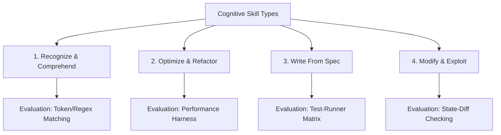

# Challenge To YOU — Cognitive Skill Taxonomy & Evaluation Mechanics

This document establishes the official taxonomy for gameplay mechanics, categorization of coding challenges, and their evaluation systems across all eras.

---

## 1. Core Cognitive Skill Types

We define 4 distinct gameplay skill categories. Each represents a unique problem-solving mode and requires a specific evaluation framework inside the Go backend engine.



### 1.1 Recognize & Comprehend
* **Objective**: The player reads code segments and identifies vulnerabilities, performance bottlenecks, or logical flaws.
* **Interaction**: Text entry, multiple-choice options, or selecting specific code line ranges in the editor.
* **Evaluation**: Simple exact-matching, regex verification, or line-number validation. No sandbox compilation is required.

### 1.2 Optimize & Refactor
* **Objective**: Given a working but inefficient script, the player must rewrite it to consume fewer resources.
* **Interaction**: Direct code editing.
* **Evaluation**: The script is executed in the Goja sandbox. The engine measures performance metrics (execution time, loop counts, heap allocations) and compares them against a hard baseline.
* **Metrics**:
  * `max_loop_iterations`: Checked via VM execution counts.
  * `execution_time_ms`: Deterministic runtime duration.
  * `memory_usage_bytes`: Tracked via Goja runtime metrics.

### 1.3 Write From Spec
* **Objective**: Classic algorithmic problem solving. Given input/output specifications, the player writes a script from scratch to automate or solve the problem.
* **Interaction**: Code writing in Godot editor.
* **Evaluation**: The Goja sandbox executes the user's script against a hidden suite of test inputs and asserts expected outputs.

### 1.4 Modify & Exploit
* **Objective**: The player modifies parameters, overrides flags, or introduces small exploits to bend existing code logic and trigger target state changes (e.g. buffer overflows, timing attacks).
* **Interaction**: Triggering events, adding payloads, or small edits.
* **Evaluation**: State-diff checking (the AxiomaticFabric state machine).

---

## 2. Difficulty Scale & Parameters

Puzzles are tagged with a difficulty tier (Easy, Medium, Hard) that scales difficulty parameters deterministically:

| Tier | Think Time Limits | Obfuscation Level | Noise (Junk Code Segments) | Sandbox Constraints (Memory/Steps) |
|---|---|---|---|---|
| **Easy** | Unlimited | None (Clean comments) | 0–1 junk blocks | Generous (e.g. 50MB, 2s) |
| **Medium** | Medium | Variable renaming | 2–3 junk blocks | Standard (e.g. 16MB, 1s) |
| **Hard** | Tight | Cryptic variable names, no comments | 4+ junk blocks | Tight (e.g. 4MB, 100ms) |

---

## 3. The Composite (Layered) Challenge Wrapper
A composite challenge is a meta-structure that chains 2 or more core challenges together. Rather than modifying the underlying engine for each sub-puzzle type, the wrapper maps outputs from one challenge stage into the input context of the next:

```
┌─────────────────┐       ┌─────────────────┐       ┌─────────────────┐
│  Stage 1:       │       │  Stage 2:       │       │  Composite      │
│  Optimize Code  │ ────► │  Exploit State  │ ────► │  Passcode       │
│  (Get Key Value)│       │  (Timing Match) │       │  Generated      │
└─────────────────┘       └─────────────────┘       └─────────────────┘
```
