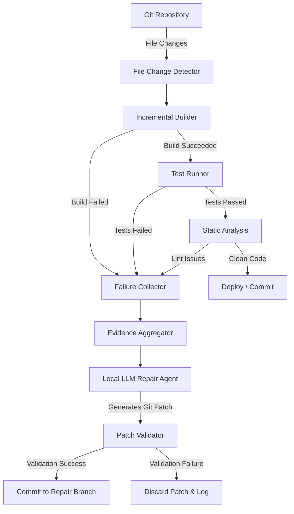

# Project Phoenix: Pipeline Architecture Specification

This document defines the high-level system architecture, scheduling pipelines, and execution flow of **Project Phoenix**—the Autonomous Development and Self-Repair Pipeline.

---

## 1. Overall System Architecture

Project Phoenix operates as a deterministic, sandboxed loop. Rather than editing code in-place, the pipeline validates every candidate patch on isolated branches.

---

## 2. Pipeline Subsystems

### 2.1 File Change Detector
- **Trigger**: Listens to file alterations inside the workspace using Git status checks or filesystem event monitoring (`fsnotify`).
- **Ignore List**: Automatically ignores modifications in documentation (`docs/`), temporary test outputs, or the system `brain/` directories.
- **Output**: Returns a list of absolute file paths modified since the last check, mapped to their respective project modules (e.g. `backend`, `client`).

### 2.2 Incremental Builder
- **Compilation Check**: Executes target-specific build tools based on modified files:
  - **Go Backend**: `go build ./...`
  - **Godot Client**: `/Applications/Godot.app/Contents/MacOS/Godot --headless --check-only`
- **Output**: Compilation exit status and standard error streams.

### 2.3 Failure Collector & Evidence Aggregator
- **Collection Phase**: If a build, test, or lint step fails, the system collects diagnostics:
  - Failing test IDs and error logs.
  - Runtime crash stack traces.
  - Active file diffs since the last stable commit.
  - Surrounding source file code blocks.
- **Aggregation Format**: Gathers this data into a structured context bundle to seed the LLM Repair prompt.
