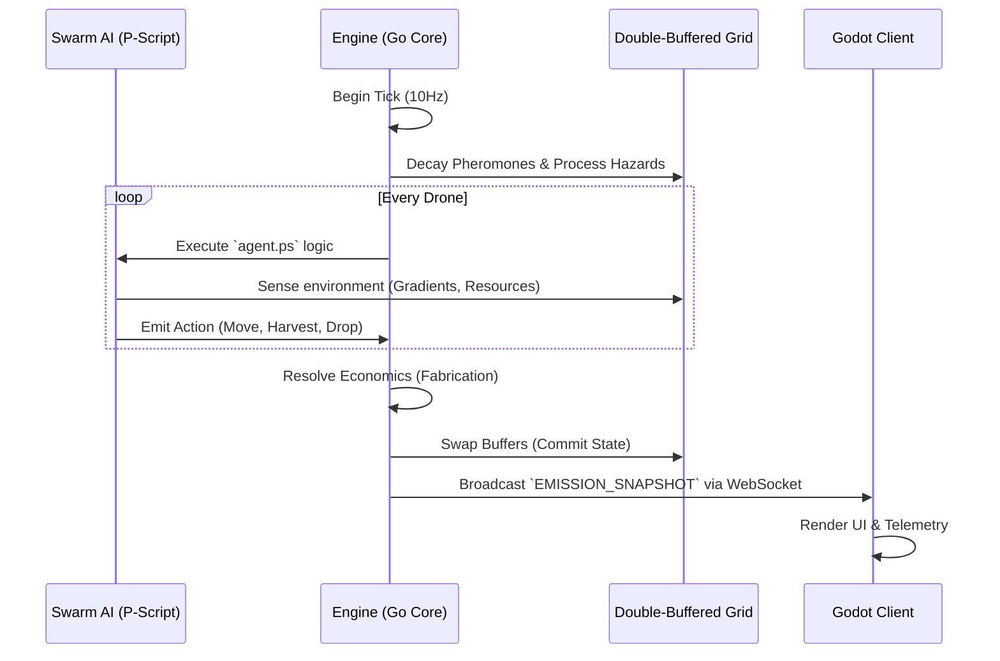

# Game Layer — Gameplay Loop

The core interaction loop of the simulation engine revolves around swarm economics and survival.

## Implemented Mechanics

- **Exploration**: Drones move randomly or follow gradients.
- **Economics**: Drones harvest silicates and return them to the base following the home pheromone gradient.
- **Fabrication**: When colony silicates reach the threshold (5), a new drone is fabricated.
- **Hazards & Contagion**: Magnetic fields drain battery. Alien nodes spread logic corruption to drones, turning them into hostile actors.
