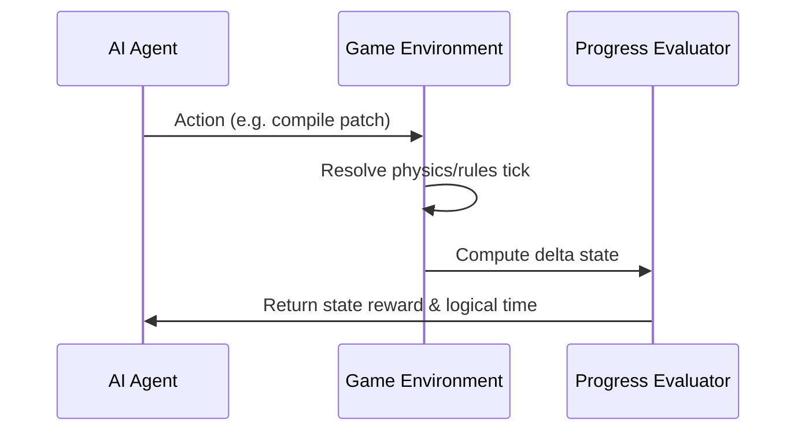

# Game Layer — Gameplay Loop

The core interaction loop of the simulation engine.

```mermaid
sequenceDiagram
    participant Agent as AI Agent
    participant Env as Game Environment
    participant Evaluator as Progress Evaluator

    Agent->>Env: Action (e.g. compile patch)
    Env->>Env: Resolve physics/rules tick
    Env->>Evaluator: Compute delta state
    Evaluator->>Agent: Return state reward & logical time
```
