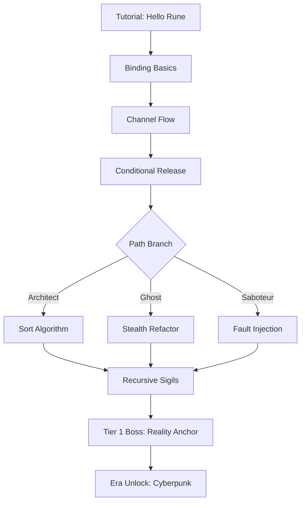

# Gameplay Mechanics

Mechanics extracted and adapted from research repositories.

---

## 1. Three Gameplay Modes (Core Design)

### From: `CHALLENGE-TO-YOU-PLAN.md` + `dothop` puzzle structure

### Architect (Builder)
- **Objective**: Write clean modules to automate systems
- **Mechanic**: Complete partial implementations, add missing functions
- **Validation**: Unit tests pass, performance within budget
- **Skill**: Algorithmic thinking, API design, planning

```gdscript
# Architect challenge data
{
  "type": "architect",
  "starter_code": "fn sort(arr) => /* TODO */",
  "requirements": [
    "O(n log n) time",
    "stable sort",
    "handles empty arrays"
  ],
  "tests": [
    {"input": "sort([3,1,2])", "expected": "[1,2,3]"},
    {"input": "sort([])", "expected": "[]"}
  ]
}
```

### Ghost (Stealth Hacker)
- **Objective**: Modify code under AI detection threshold
- **Mechanic**: Edit existing code; each edit increases vigilance
- **Constraint**: Vigilance meter must stay < 100%
- **Skill**: Optimization, minimal changes, stealth mindset

```gdscript
# Ghost challenge data
{
  "type": "ghost",
  "target_code": "fn process(data) { for i in 0..len(data) { expensive_op(data[i]) } }",
  "goal": "Reduce complexity from O(n²) to O(n log n)",
  "vigilance_budget": 0.7,  # Max 70% detection
  "detection_rules": [
    "loop_nesting > 2: +15%",
    "new_import: +10%",
    "variable_rename: +2%"
  ]
}
```

### Saboteur (Chaos Agent)
- **Objective**: Break code to cause chain reactions
- **Mechanic**: Inject faults; observe cascading failures
- **Win Condition**: Trigger specific environmental mutation
- **Skill**: Systems thinking, critical analysis, judgment

```gdscript
# Saboteur challenge data
{
  "type": "saboteur",
  "system_code": "{ auth, database, cache, logger }",
  "target_mutation": "cache_poisoned",
  "available_faults": [
    "null_pointer_injection",
    "race_condition_trigger",
    "memory_leak_induction",
    "timeout_reduction"
  ],
  "chain_reaction_map": {
    "null_pointer_injection": ["auth_crash", "cascade_to_database"],
    "race_condition_trigger": ["cache_inconsistency", "cache_poisoned"]
  }
}
```

---

## 2. Multi-Era Progression

### From: `CHALLENGE-TO-YOU-PLAN.md` + `dothop` seasonal packs

| Era | Theme | DSL/Language | Aesthetic | Core Mechanics |
|-----|-------|--------------|-----------|----------------|
| **Tier 1** | Medieval Magitech | **Pscript** (Runes/Incantations) | Dark, mystical, parchment | Rune binding, mana flow, sigil chains |
| **Tier 2** | Cyberpunk Neon | **Python/JS subset** | Neon, terminal, corporate | Memory manipulation, async exploits, netrunning |
| **Tier 3** | Dieselpunk | **C/Rust-like** | Brass, gears, oil | Register allocation, pointer arithmetic |
| **Tier 4** | Cosmic Space | **Quantum DSL** | Stars, void, alien | Superposition, entanglement, decoherence |

### Era-Specific Mechanics

#### Magitech (Tier 1)
```gdscript
# Pscript syntax example
rune:bind(source: "mana_well", target: "golem_core")
rune:channel(path: ["sigil_a", "sigil_b", "sigil_c"])
rune:release(condition: "lunar_phase == full")

# Glitch: Overload mana well → reality fracture
# Loophole: Bind to void rune → infinite mana (high vigilance)
```

#### Cyberpunk (Tier 2)
```python
# Python subset syntax
def exploit(buffer):
    # Stack smash with ROP chain
    payload = b"A" * 64 + p64(rop_gadget) + shellcode
    return send(payload)

# Glitch: TOCTOU on file descriptor
# Loophole: Race condition between check and use
```

---

## 3. Luck & Volatility Engine

### From: `CHALLENGE-TO-YOU-PLAN.md` + roguelike patterns

```go
// generator/luck.go
type LuckEngine struct {
    baseLuck     float64  // 0.0 - 1.0
    volatility   float64  // How much luck swings
    rng          *rand.Rand
}

func (le *LuckEngine) GenerateChallenge(seed int64, playerLuck float64) Challenge {
    le.rng = rand.New(rand.NewSource(seed))
    
    // Effective luck = base + player + noise
    effective := le.baseLuck + playerLuck + le.rng.NormFloat64()*le.volatility
    effective = clamp(effective, 0.0, 1.0)
    
    return Challenge{
        ObfuscationLevel:     lerp(0.2, 0.9, 1.0-effective),
        VigilanceStrictness:  lerp(0.3, 0.95, 1.0-effective),
        GlitchAvailability:   effective > 0.7,      // High luck = obvious glitches
        LoopholeClarity:      effective,             // High luck = clear hints
        RedHerringCount:      int(lerp(5, 0, effective)),
        Seed:                 seed,
    }
}

func lerp(a, b, t float64) float64 { return a + (b-a)*t }
func clamp(v, min, max float64) float64 { 
    if v < min { return min }
    if v > max { return max }
    return v 
}
```

### Effects by Luck Tier
| Luck | Obfuscation | Vigilance | Glitches | Hints |
|------|-------------|-----------|----------|-------|
| **High** (0.8+) | Light | Lenient | Obvious, multiple | Clear, direct |
| **Medium** (0.4-0.8) | Moderate | Standard | Hidden, 1-2 | Subtle, environmental |
| **Low** (0.0-0.4) | Heavy | Aggressive | Obfuscated, 0-1 | Misleading, rare |

---

## 4. Passcode Generation

### From: `CHALLENGE-TO-YOU-PLAN.md` + `dothop` LOGOS tokens

```go
// passcode/engine.go
type PasscodeEngine struct {
    vm          *VM
    glitchDetec *GlitchDetector
}

type PasscodeResult struct {
    Code        string            // The actual passcode
    Source      PasscodeSource    // How it was generated
    Mutations   map[string]any    // World state changes
    Vigilance   float64           // Final vigilance level
}

type PasscodeSource int
const (
    SourceDirectOutput PasscodeSource = iota  // print() output
    SourceErrorLog                            // Error message hash
    SourceMemoryLeak                          // Leaked address
    SourceTimingVariance                      // Execution time
    SourceGlitchExploit                       // Emergent glitch
    SourceChainReaction                       // Saboteur cascade
)

func (pe *PasscodeEngine) Generate(ctx *ExecutionContext) *PasscodeResult {
    var result PasscodeResult
    
    // 1. Check direct output
    if emit := ctx.LastEmit(); emit != "" {
        return &PasscodeResult{
            Code:     hashPasscode(emit),
            Source:   SourceDirectOutput,
        }
    }
    
    // 2. Check error logs
    if errLog := ctx.ErrorLog(); errLog != "" {
        if strings.Contains(errLog, "SEGFAULT") || strings.Contains(errLog, "OVERFLOW") {
            return &PasscodeResult{
                Code:     hashPasscode(errLog),
                Source:   SourceErrorLog,
            }
        }
    }
    
    // 3. Check for glitches (emergent behavior)
    if glitch := pe.glitchDetec.Analyze(ctx); glitch != nil {
        return &PasscodeResult{
            Code:       glitch.Passcode,
            Source:     SourceGlitchExploit,
            Mutations:  glitch.WorldMutations,
        }
    }
    
    // 4. Check timing side-channels
    if timing := ctx.TimingProfile(); timing.Variance > threshold {
        return &PasscodeResult{
            Code:     hashPasscode(fmt.Sprintf("%d", timing.MeanMicros)),
            Source:   SourceTimingVariance,
        }
    }
    
    return nil // No passcode generated
}
```

### Glitch Detection
```go
// passcode/glitch.go
type GlitchDetector struct {
    patterns []GlitchPattern
}

type GlitchPattern struct {
    Name           string
    DetectFn       func(*ExecutionContext) bool
    PasscodeGen    func(*ExecutionContext) string
    Mutations      map[string]any
    VigilanceCost  float64
}

var BuiltinPatterns = []GlitchPattern{
    {
        Name: "Integer Overflow",
        DetectFn: func(ctx *ExecutionContext) bool {
            return ctx.StackOverflow() || ctx.IntOverflow()
        },
        PasscodeGen: func(ctx *ExecutionContext) string {
            return fmt.Sprintf("OVERFLOW-%X", ctx.OverflowAddress())
        },
        Mutations: map[string]any{"memory_corrupted": true},
        VigilanceCost: 0.3,
    },
    {
        Name: "Race Condition",
        DetectFn: func(ctx *ExecutionContext) bool {
            return ctx.DetectedRace()
        },
        PasscodeGen: func(ctx *ExecutionContext) string {
            return fmt.Sprintf("RACE-%d", ctx.RaceTimestamp())
        },
        Mutations: map[string]any{"cache_poisoned": true},
        VigilanceCost: 0.2,
    },
}
```

---

## 5. Puzzle Dependency Flow

### From: `godot_puzzle_dependencies` + `dothop`



### Unlock Conditions
```gdscript
# EraUnlock.gd
func check_era_unlock(era: String) -> bool:
    match era:
        "cyberpunk":
            return completed_count("magitech") >= 15 \
               and has_completed("reality_anchor") \
               and luck_engine.get_persistent_luck() > 0.3
        "dieselpunk":
            return completed_count("cyberpunk") >= 12 \
               and has_completed("netrunner_final")
        "cosmic":
            return completed_count("dieselpunk") >= 10 \
               and has_completed("kernel_breach")
```

---

## 6. Vigilance / Detection System (Ghost Mode)

### From: `CHALLENGE-TO-YOU-PLAN.md` + `dothop` Archon vigilance

```go
// generator/vigilance.go
type VigilanceTracker struct {
    level       float64  // 0.0 - 1.0
    thresholds  []VigilanceThreshold
    rng         *rand.Rand
}

type VigilanceThreshold struct {
    Level       float64
    Consequence string  // "warning", "scan", "purge", "lockdown"
}

var DefaultThresholds = []VigilanceThreshold{
    {0.3, "warning"},
    {0.5, "scan"},
    {0.7, "purge"},
    {0.9, "lockdown"},
}

func (vt *VigilanceTracker) ApplyAction(action EditAction) {
    cost := vt.actionCost(action)
    vt.level = min(1.0, vt.level+cost)
    
    for _, t := range vt.thresholds {
        if vt.level >= t.Level && !vt.triggered[t.Consequence] {
            vt.trigger(t.Consequence)
        }
    }
}

func (vt *VigilanceTracker) actionCost(action EditAction) float64 {
    switch action.Type {
    case "insert_line": return 0.02
    case "delete_line": return 0.03
    case "modify_loop": return 0.08
    case "add_import": return 0.10
    case "rename_var": return 0.01
    case "restructure_fn": return 0.15
    }
    return 0.05
}
```

### UI Feedback
```gdscript
# VigilanceMeter.gd
func update_vigilance(level: float):
    $Bar.value = level * 100
    if level < 0.3:
        $Bar.theme = theme_green
    elif level < 0.6:
        $Bar.theme = theme_yellow
    elif level < 0.9:
        $Bar.theme = theme_orange
    else:
        $Bar.theme = theme_red
        $WarningLabel.show()
```

---

## 7. Hint Archive System

### From: `CHALLENGE-TO-YOU-PLAN.md` + `godot_recipes` (save system)

```gdscript
# HintArchive.gd
class_name HintArchive
extends Resource

var hints: Dictionary = {}  # puzzle_id -> Array[Hint]

func unlock_hint(puzzle_id: String, hint: Hint):
    if not hints.has(puzzle_id):
        hints[puzzle_id] = []
    hints[puzzle_id].append(hint)
    save()

func get_hints(puzzle_id: String) -> Array[Hint]:
    return hints.get(puzzle_id, [])

func can_unlock_hint(puzzle_id: String) -> bool:
    var puzzle = PuzzleLoader.load(puzzle_id)
    var attempts = get_attempt_count(puzzle_id)
    return attempts >= puzzle.hint_threshold
```

### Hint Types
```gdscript
class Hint:
    var id: String
    var tier: int  # 1 = subtle, 2 = moderate, 3 = direct
    var text: String
    var cost: int  # Luck points or vigilance
    var condition: String  # "attempts >= 3", "luck < 0.3"
```

---

## 8. Scoring & Leaderboards

```go
// scoring.go
type Score struct {
    PuzzleID      string
    Mode          Mode
    TimeMs        int64
    VigilanceUsed float64
    LuckSpent     float64
    PasscodeSource PasscodeSource
    Elegance      float64  // Code quality metric
    Timestamp     int64
}

func (s Score) Calculate() int {
    base := 10000
    timeBonus := max(0, 5000 - s.TimeMs/100)
    vigilanceBonus := int((1.0 - s.VigilanceUsed) * 3000)
    eleganceBonus := int(s.Elegance * 2000)
    sourceMultiplier := s.passcodeMultiplier()
    
    return (base + timeBonus + vigilanceBonus + eleganceBonus) * sourceMultiplier
}

func (s Score) passcodeMultiplier() float64 {
    switch s.PasscodeSource {
    case SourceDirectOutput: return 1.0
    case SourceErrorLog: return 1.2
    case SourceMemoryLeak: return 1.5
    case SourceTimingVariance: return 1.8
    case SourceGlitchExploit: return 2.0
    case SourceChainReaction: return 2.5
    }
    return 1.0
}
```

---

## 9. Content Pipeline

### From: `dothop` (.puzz) + `godot_coding_challenge` (per-project)

```
content/
├── eras/
│   ├── magitech/
│   │   ├── packs/
│   │   │   ├── tier1_basics.challengepack
│   │   │   ├── tier1_advanced.challengepack
│   │   │   └── boss_reality_anchor.challengepack
│   │   ├── templates/
│   │   │   ├── rune_binding.template
│   │   │   ├── sigil_chain.template
│   │   │   └── mana_flow.template
│   │   └── theme.tres
│   └── cyberpunk/
│       ├── packs/
│       ├── templates/
│       └── theme.tres
├── shared/
│   ├── algorithms/          # Algorithm templates
│   │   ├── sorting/
│   │   ├── graph/
│   │   └── dp/
│   └── test_cases/          # Canonical test cases
```

### Pack Format
```json
{
  "version": 1,
  "era": "magitech",
  "tier": 1,
  "name": "Rune Binding Basics",
  "description": "Learn to bind mana sources to constructs",
  "prerequisites": [],
  "unlocks": ["sigil_chains"],
  "challenges": [
    { "id": "bind_01", "template": "rune_binding", "params": {"difficulty": 0.2} },
    { "id": "bind_02", "template": "rune_binding", "params": {"difficulty": 0.4} },
    { "id": "bind_03", "template": "mana_flow", "params": {"leak": true} }
  ],
  "luck_modifier": 0.1
}
```